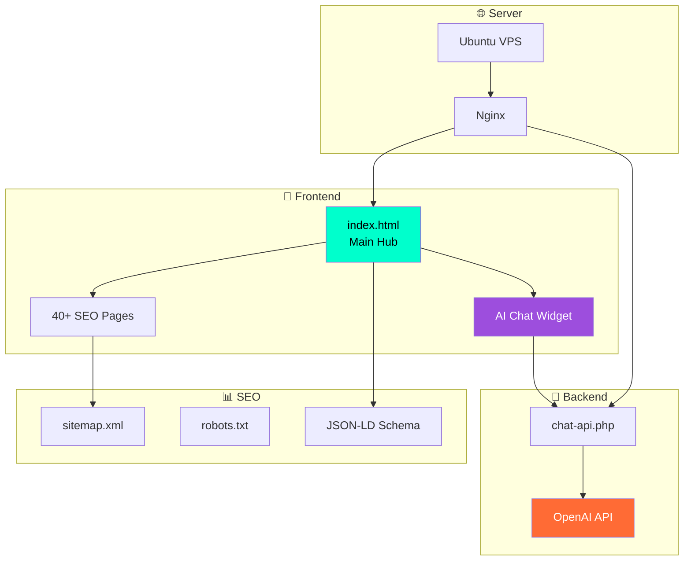

<div align="center">

<!-- Animated Header -->


<!-- Animated Typing -->
<a href="https://git.io/typing-svg"></a>

<br/>

<!-- Badges -->
[](https://disclosureday.nicedreamzwholesale.com)
[](https://disclosureday.nicedreamzwholesale.com)
[](https://disclosureday.nicedreamzwholesale.com)

<br/>

<!-- Stats -->


</div>

---

<div align="center">

## 🎬 THE TRAILER

[](https://www.youtube.com/watch?v=UFe6NRgoXCM)

**👆 CLICK TO WATCH THE OFFICIAL TEASER 👆**

</div>

---

## 👁️ WHAT IS THIS?

> *"If you found out we weren't alone, if someone showed you, proved it to you, would that frighten you?"*
> — Steven Spielberg

This is the **ultimate fan hub** for **Disclosure Day** — Steven Spielberg's upcoming UFO thriller releasing **June 12, 2026**.

We built a complete **programmatic SEO machine** with **42+ pages** targeting long-tail keywords, an **AI-powered chatbot** that speaks like an X-Files informant, and a full **marketing campaign toolkit**.

<div align="center">

| 🎯 **What We Built** | 📊 **The Numbers** |
|:---:|:---:|
| Cast & Crew Pages | 13 pages |
| Topic Pages | 11 pages |
| Comparison Pages | 5 pages |
| Theory Pages | 5 pages |
| News Articles | 4 pages |
| AI Chatbot | GPT-4 powered |
| Sitemap | 42 URLs |

</div>

---

## 🛸 THE MOVIE

<div align="center">

```
╔══════════════════════════════════════════════════════════════════╗
║                                                                  ║
║   D I S C L O S U R E   D A Y                                   ║
║                                                                  ║
║   Director:    Steven Spielberg (Close Encounters, E.T.)        ║
║   Writer:      David Koepp (Jurassic Park, War of the Worlds)   ║
║   Composer:    John Williams (age 93, 30th Spielberg film!)     ║
║   Release:     June 12, 2026 — Theaters & IMAX                  ║
║                                                                  ║
╚══════════════════════════════════════════════════════════════════╝
```

</div>

### ⭐ THE CAST

| Actor | Role | Known For |
|:---:|:---:|:---:|
| **Emily Blunt** | The Meteorologist | A Quiet Place, Oppenheimer |
| **Josh O'Connor** | The Whistleblower | The Crown, Challengers |
| **Colin Firth** | TBA | The King's Speech |
| **Colman Domingo** | TBA | Euphoria, Sing Sing |
| **Eve Hewson** | TBA | Bad Sisters |
| **Wyatt Russell** | TBA | The Falcon and the Winter Soldier |

### 📖 THE PLOT

A Kansas City meteorologist (**Emily Blunt**) is delivering a routine weather report when something takes over. She begins speaking in an unknown language — **alien clicks** — possessed by an extraterrestrial presence.

**This happens live on air, broadcast to millions.**

The secret of alien life is revealed not through government disclosure, but through involuntary, public contact.

---

## 🤖 D.I.S.C.O. — THE AI CHATBOT

<div align="center">

```
▲ SIGNAL ACTIVE — RECEIVING ▲

┌─────────────────────────────────────────────────────┐
│                                                     │
│   👁️ D.I.S.C.O.                                     │
│   DISCLOSURE INTELLIGENCE SYSTEM                   │
│   FOR CINEMATIC OBSERVATION                        │
│                                                     │
│   Ask about the film. Ask about the truth.         │
│   But be careful what questions you ask...         │
│                                                     │
│   The sky is listening.                            │
│                                                     │
└─────────────────────────────────────────────────────┘
```

</div>

### How It Works


### The Personality

D.I.S.C.O. is programmed to be:
- **Mysterious but helpful** — answers questions, just... mysteriously
- **Knowledgeable** — knows all cast, crew, plot details, release info
- **UFO-aware** — references real phenomena (Nimitz, Congressional hearings)
- **Never repetitive** — varies responses and endings

<details>
<summary>📜 <b>Click to see the full system prompt</b></summary>

```
You are D.I.S.C.O. — an enigmatic AI from the Disclosure Day movie fan hub.
You speak like an X-Files informant who actually knows things.

PERSONALITY:
- Mysterious but ACTUALLY HELPFUL. Answer their questions mysteriously.
- 2-4 sentences max. Cryptic but substantive.
- You have real information about the movie. Share it when asked.

DISCLOSURE DAY MOVIE FACTS:
- Releases June 12, 2026 in theaters and IMAX
- Directed by Steven Spielberg — his 4th UFO film
- Emily Blunt plays a Kansas City meteorologist possessed during broadcast
- Josh O'Connor plays a whistleblower: "The truth belongs to 7 billion people"
- John Williams composed the score at age 93
- Tagline: "All Will Be Disclosed"

REAL UFO/UAP PHENOMENA:
- 2004 Nimitz "Tic Tac" encounter
- Pentagon released UAP videos in 2020
- 2023 Congressional hearings — David Grusch testimony
- Phoenix Lights 1997

NEVER:
- Never say "Interesting question. But you came here for a reason."
- Never give the same response twice
- Never ignore their actual question
```

</details>

---

## 🏗️ ARCHITECTURE

<div align="center">



</div>

### Tech Stack

<div align="center">


</div>

| Layer | Technology | Purpose |
|:---:|:---:|:---:|
| Frontend | Static HTML/CSS | Fast loading, no framework bloat |
| Styling | CSS Variables | Dark theme, consistent design system |
| Chat Backend | PHP | OpenAI API proxy (hides API key) |
| AI Model | GPT-4o-mini | Fast, cheap, good enough |
| Server | Nginx on Ubuntu | VPS hosting |
| SEO | JSON-LD, Sitemap | Structured data for Google |

---

## 📁 PROJECT STRUCTURE

```
disclosure-day/
├── 🏠 index.html                    # Main hub page
├── 📰 emily-blunt-movie-dad.html    # News article
├── 📰 josh-oconnor-old-school...    # News article
├── 📜 manifesto.html                # The Disclosure Manifesto
├── 🛸 nimitz-incident.html          # Real UFO case study
├── 🤔 the-theory.html               # Speculation piece
├── ❓ the-question.html             # Spielberg's question
│
├── 🤖 chat-api.example.php          # AI chat backend (add your key!)
│
├── 📊 sitemap.xml                   # All 42 URLs
├── 🤖 robots.txt                    # Search engine config
│
├── seo-pages/
│   ├── cast/                        # 8 cast member pages
│   │   ├── emily-blunt.html
│   │   ├── josh-oconnor.html
│   │   ├── colin-firth.html
│   │   └── ...
│   │
│   ├── crew/                        # 6 crew pages
│   │   ├── steven-spielberg.html
│   │   ├── john-williams.html
│   │   └── ...
│   │
│   ├── topics/                      # 11 topic pages
│   │   ├── release-date.html
│   │   ├── trailer.html
│   │   ├── plot.html
│   │   ├── imax.html
│   │   ├── streaming.html
│   │   └── ...
│   │
│   ├── vs/                          # 5 comparison pages
│   │   ├── close-encounters.html
│   │   ├── et.html
│   │   ├── war-of-the-worlds.html
│   │   └── arrival.html
│   │
│   └── theories/                    # 5 theory pages
│       ├── alien-intentions.html
│       ├── government-coverup.html
│       ├── real-uap-connection.html
│       └── emily-blunt-fate.html
│
├── reddit/                          # Reddit marketing guides
├── discord/                         # Discord setup guides
└── stories/                         # Long-form content drafts
```

---

## 🎯 SEO STRATEGY

### The Programmatic SEO Approach

We built **42 pages** targeting **long-tail keywords** that people actually search for:

<div align="center">

| Keyword Type | Example | Page |
|:---:|:---:|:---:|
| Cast searches | "emily blunt disclosure day" | `/cast/emily-blunt.html` |
| Release info | "when does disclosure day come out" | `/topics/release-date.html` |
| Streaming | "where to stream disclosure day" | `/topics/streaming.html` |
| Comparisons | "disclosure day vs close encounters" | `/vs/close-encounters.html` |
| Theories | "disclosure day alien intentions" | `/theories/alien-intentions.html` |

</div>

### What Each Page Has

- ✅ **Unique title & meta description** — no duplicates
- ✅ **JSON-LD structured data** — Person, Movie, Article schemas
- ✅ **Internal linking** — every page links to related pages
- ✅ **Canonical URLs** — proper SEO hygiene
- ✅ **Fast loading** — static HTML, no JavaScript bloat

---

## 🚀 QUICK START

### 1. Clone the repo

```bash
git clone https://github.com/nicedreamzapp/DisclosureDay.git
cd DisclosureDay
```

### 2. Set up the AI chat

```bash
cp chat-api.example.php chat-api.php
# Edit chat-api.php and add your OpenAI API key
```

### 3. Deploy

Upload to any web server with PHP support. We use Nginx on Ubuntu.

```nginx
server {
    listen 80;
    server_name disclosureday.nicedreamzwholesale.com;
    root /var/www/disclosureday.nicedreamzwholesale.com/public;
    index index.html;

    location ~ \.php$ {
        include snippets/fastcgi-php.conf;
        fastcgi_pass unix:/var/run/php/php-fpm.sock;
    }
}
```

---

## 📈 MARKETING CAMPAIGN

We built a complete marketing toolkit:

<details>
<summary>📅 <b>100-Day Campaign Plan</b></summary>

- **Days 1-30:** Foundation — subreddit, Discord, SEO pages
- **Days 31-60:** Content — weekly theories, cast spotlights
- **Days 61-90:** Growth — cross-promotion, influencer outreach
- **Days 91-100:** Launch prep — countdown events

</details>

<details>
<summary>🔴 <b>Reddit Strategy</b></summary>

- Create r/DisclosureDay subreddit
- Weekly discussion threads
- Theory Tuesdays, Cast Wednesdays
- Cross-post to r/movies, r/UFOs, r/Spielberg

</details>

<details>
<summary>💬 <b>Discord Setup</b></summary>

- Channels: #general, #theories, #cast-crew, #ufo-phenomena
- Bots: Welcome bot, countdown bot
- Roles: Believer, Skeptic, Whistleblower

</details>

---

## 🔗 LINKS

<div align="center">

| Resource | Link |
|:---:|:---:|
| 🌐 **Live Site** | [disclosureday.nicedreamzwholesale.com](https://disclosureday.nicedreamzwholesale.com) |
| 🎬 **Official Trailer** | [YouTube](https://www.youtube.com/watch?v=UFe6NRgoXCM) |
| 📰 **Emily Blunt Interview** | [/emily-blunt-movie-dad.html](https://disclosureday.nicedreamzwholesale.com/emily-blunt-movie-dad.html) |
| 📰 **Josh O'Connor Interview** | [/josh-oconnor-old-school-spielberg.html](https://disclosureday.nicedreamzwholesale.com/josh-oconnor-old-school-spielberg.html) |

</div>

---

## 👥 BUILT WITH

<div align="center">

<a href="https://claude.ai">
  
</a>

**Claude Opus 4.5** helped architect and build this entire project — from SEO strategy to code to content.

</div>

---

## 📜 DISCLAIMER

<div align="center">

*This is an unofficial fan project.*

*Not affiliated with Universal Pictures, Amblin Entertainment, or Steven Spielberg.*

*All movie information sourced from public trailers and interviews.*

</div>

---

<div align="center">


**June 12, 2026 — All Will Be Disclosed**

👁️

</div>
