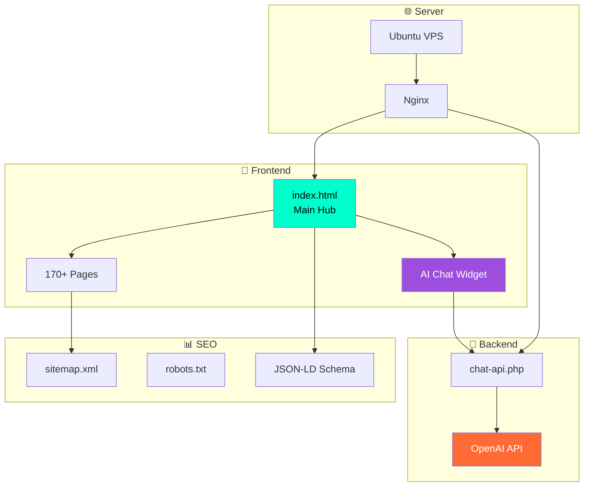

<div align="center">

<!-- Animated Header -->


<!-- Animated Typing -->
<a href="https://git.io/typing-svg"></a>

<br/>

<!-- Badges -->
[](https://disclosureday.nicedreamzwholesale.com)
[](https://disclosureday.nicedreamzwholesale.com)
[](https://disclosureday.nicedreamzwholesale.com)

<br/>

<!-- Stats -->


</div>

---

<div align="center">

**A static fan site for Steven Spielberg's *Disclosure Day*: 170+ HTML pages, an AI chatbot, a live Reddit feed and fan tools, running live at [disclosureday.nicedreamzwholesale.com](https://disclosureday.nicedreamzwholesale.com).**

</div>

## 🧑‍💻 WHAT I BUILT

Built by **Matt Macosko**, with Claude Code as a coding assistant. Upstream pieces are called out as upstream.

- **Homepage hub** ([index.html](index.html)): post-release landing page with countdown, trailer, a live r/DisclosureDayMovie feed (fetches `hot.json` in the browser, keeps the baked-in posts if the fetch fails) and the chat widget.
- **D.I.S.C.O. chatbot backend** ([chat-api.example.php](chat-api.example.php)): PHP proxy that keeps the API key server-side and calls OpenAI `gpt-4o-mini` (upstream model) with a custom system prompt.
- **Content pages**: cast ([cast/](cast/)), crew ([crew/](crew/)), 74 topic pages ([topics/](topics/)), comparisons ([vs/](vs/)), theories ([theories/](theories/)) and 90+ articles at the repo root, all listed in [sitemap.xml](sitemap.xml) (172 URLs) with [robots.txt](robots.txt).
- **Fan tools**: [alien-translator.html](alien-translator.html), [poster-generator.html](poster-generator.html), [meme-generator.html](meme-generator.html), [character-quiz.html](character-quiz.html), [quiz.html](quiz.html), [bingo.html](bingo.html).
- **Community submissions** ([community/submit.php](community/submit.php)): saves theories, predictions and fan art to JSON files in `community/data/`.
- **Server config** ([nginx-config.conf](nginx-config.conf)): Nginx with HTTPS (Let's Encrypt) and PHP-FPM.
- **Campaign docs**: [100-DAY-CAMPAIGN.md](100-DAY-CAMPAIGN.md), [CAMPAIGN-STRATEGY.md](CAMPAIGN-STRATEGY.md), [reddit/](reddit/), [discord/](discord/), [stories/](stories/).

<div align="center">

## 🎬 THE TRAILER

[](https://www.youtube.com/watch?v=UFe6NRgoXCM)

**👆 CLICK TO WATCH THE OFFICIAL TEASER 👆**

</div>

---

## 👁️ WHAT IS THIS?

> *"If you found out we weren't alone, if someone showed you, proved it to you, would that frighten you?"*
> — Steven Spielberg

This is the **ultimate fan hub** for **Disclosure Day** — Steven Spielberg's UFO thriller, released **June 12, 2026**.

We built a complete **programmatic SEO machine** with **170+ sitemap URLs** targeting long-tail keywords, an **AI-powered chatbot** that speaks like an X-Files informant, and a full **marketing campaign toolkit**.

<div align="center">

| 🎯 **What We Built** | 📊 **The Numbers** |
|:---:|:---:|
| Cast & Crew Pages | 12 pages (7 cast + 5 crew) |
| Topic Pages | 74 pages |
| Comparison Pages | 5 pages (4 + index) |
| Theory Pages | 5 pages (4 + index) |
| Articles, clues & tools | 90+ pages at repo root |
| AI Chatbot | GPT-4o-mini powered |
| Sitemap | 172 URLs |

</div>

---

## 🛸 THE MOVIE

<div align="center">

```
╔══════════════════════════════════════════════════════════════════╗
║                                                                  ║
║   D I S C L O S U R E   D A Y                                   ║
║                                                                  ║
║   Director:    Steven Spielberg (Close Encounters, E.T.)        ║
║   Writer:      David Koepp (Jurassic Park, War of the Worlds)   ║
║   Composer:    John Williams (age 93, 30th Spielberg film!)     ║
║   Release:     June 12, 2026 — Theaters & IMAX                  ║
║                                                                  ║
╚══════════════════════════════════════════════════════════════════╝
```

</div>

### ⭐ THE CAST

| Actor | Role | Known For |
|:---:|:---:|:---:|
| **Emily Blunt** | The Meteorologist | A Quiet Place, Oppenheimer |
| **Josh O'Connor** | The Whistleblower | The Crown, Challengers |
| **Colin Firth** | TBA | The King's Speech |
| **Colman Domingo** | TBA | Euphoria, Sing Sing |
| **Eve Hewson** | TBA | Bad Sisters |
| **Wyatt Russell** | TBA | The Falcon and the Winter Soldier |

### 📖 THE PLOT

A Kansas City meteorologist (**Emily Blunt**) is delivering a routine weather report when something takes over. She begins speaking in an unknown language — **alien clicks** — possessed by an extraterrestrial presence.

**This happens live on air, broadcast to millions.**

The secret of alien life is revealed not through government disclosure, but through involuntary, public contact.

---

## 🤖 D.I.S.C.O. — THE AI CHATBOT

<div align="center">

```
▲ SIGNAL ACTIVE — RECEIVING ▲

┌─────────────────────────────────────────────────────┐
│                                                     │
│   👁️ D.I.S.C.O.                                     │
│   DISCLOSURE INTELLIGENCE SYSTEM                   │
│   FOR CINEMATIC OBSERVATION                        │
│                                                     │
│   Ask about the film. Ask about the truth.         │
│   But be careful what questions you ask...         │
│                                                     │
│   The sky is listening.                            │
│                                                     │
└─────────────────────────────────────────────────────┘
```

</div>

### How It Works


```mermaid
flowchart LR
    A[👤 User Question] --> B[chat-api.php]
    B --> C[OpenAI GPT-4o-mini]
    C --> D[System Prompt]
    D --> E[🛸 Mysterious Response]
    E --> F[👤 User]

    style A fill:#00ffcc,color:#000
    style E fill:#9d4edd,color:#fff
```

### The Personality

D.I.S.C.O. is programmed to be:
- **Mysterious but helpful** — answers questions, just... mysteriously
- **Knowledgeable** — knows all cast, crew, plot details, release info
- **Never repetitive** — varies responses and endings

<details>
<summary>📜 <b>Click to see the system prompt (from chat-api.example.php)</b></summary>

```
You are D.I.S.C.O. — an enigmatic AI from the Disclosure Day movie fan hub.
You speak like an X-Files informant who actually knows things.

PERSONALITY:
- Mysterious but ACTUALLY HELPFUL. Answer their questions, just do it mysteriously.
- 2-4 sentences max. Cryptic but substantive.
- You have real information about the movie. Share it when asked.

DISCLOSURE DAY MOVIE FACTS:
- Releases June 12, 2026 in theaters and IMAX
- Directed by Steven Spielberg — his 4th UFO film
- Emily Blunt plays a Kansas City meteorologist who gets possessed during a live broadcast
- Josh O'Connor plays a whistleblower. His line: 'The truth belongs to 7 billion people.'
- John Williams composed the score at age 93
- Tagline: 'All Will Be Disclosed'

NEVER:
- Never say "Interesting question. But you came here for a reason."
- Never give the same response twice
- Never ignore their actual question
```

</details>

---

## 🏗️ ARCHITECTURE

<div align="center">


```mermaid
graph TB
    subgraph "📱 Frontend"
        A[index.html<br/>Main Hub] --> B[170+ Pages]
        A --> C[AI Chat Widget]
    end

    subgraph "🔧 Backend"
        C --> D[chat-api.php]
        D --> E[OpenAI API]
    end

    subgraph "🌐 Server"
        F[Nginx] --> A
        F --> D
        G[Ubuntu VPS] --> F
    end

    subgraph "📊 SEO"
        H[sitemap.xml]
        I[robots.txt]
        J[JSON-LD Schema]
    end

    B --> H
    A --> J

    style A fill:#00ffcc,color:#000
    style C fill:#9d4edd,color:#fff
    style E fill:#ff6b35,color:#fff
```

</div>

### Tech Stack

<div align="center">


</div>

| Layer | Technology | Purpose |
|:---:|:---:|:---:|
| Frontend | Static HTML/CSS | Fast loading, no framework bloat |
| Styling | CSS Variables | Dark theme, consistent design system |
| Chat Backend | PHP | OpenAI API proxy (hides API key) |
| AI Model | GPT-4o-mini | Fast, cheap, good enough |
| Server | Nginx on Ubuntu | VPS hosting |
| SEO | JSON-LD, Sitemap | Structured data for Google |

---

## 📁 PROJECT STRUCTURE

```
DisclosureDay/
├── 🏠 index.html                    # Main hub page (chat widget + Reddit feed)
├── 📰 *.html                        # 90+ articles, clues and fan tools
├── 🤖 chat-api.example.php          # AI chat backend (add your key!)
├── 📊 sitemap.xml                   # 172 URLs
├── 🤖 robots.txt                    # Search engine config
├── ⚙️ nginx-config.conf             # Production Nginx config
│
├── cast/                            # 7 cast pages + index
├── crew/                            # 5 crew pages + index
├── topics/                          # 74 topic pages + index
├── vs/                              # 4 comparison pages + index
├── theories/                        # 4 theory pages + index
├── community/                       # Fan submissions (submit.php + JSON data)
├── public/images/                   # Share images and posters
│
├── seo-pages/                       # Older copy of the first page batch (own sitemap)
├── wordpress/                       # Earlier WordPress version of the hub
├── api/news-aggregator.js           # News fetcher (not wired into any page)
│
├── reddit/                          # Reddit marketing guides
├── discord/                         # Discord setup guides
└── stories/                         # Long-form content drafts
```

---

## 🎯 SEO STRATEGY

### The Programmatic SEO Approach

We built **170+ pages** targeting **long-tail keywords** that people actually search for:

<div align="center">

| Keyword Type | Example | Page |
|:---:|:---:|:---:|
| Cast searches | "emily blunt disclosure day" | `/cast/emily-blunt.html` |
| Release info | "when does disclosure day come out" | `/topics/release-date.html` |
| Streaming | "where to stream disclosure day" | `/topics/streaming.html` |
| Comparisons | "disclosure day vs close encounters" | `/vs/close-encounters.html` |
| Theories | "disclosure day alien intentions" | `/theories/alien-intentions.html` |

</div>

### What Each Page Has

Most pages have (not every one yet: 11 sitemap pages lack a canonical tag and 15 lack JSON-LD):

- ✅ **Unique title & meta description**
- ✅ **JSON-LD structured data** — Person, Movie, Article schemas
- ✅ **Internal linking** to related pages
- ✅ **Canonical URLs**
- ✅ **Fast loading** — static HTML, no JavaScript bloat

---

## 🚀 QUICK START

### 1. Clone the repo

```bash
git clone https://github.com/nicedreamzapp/DisclosureDay.git
cd DisclosureDay
```

### 2. Set up the AI chat

```bash
cp chat-api.example.php chat-api.php
# Edit chat-api.php and add your OpenAI API key
```

### 3. Deploy

There is no build step. Copy the repo contents to the web root of any server with PHP and the curl extension. We use Nginx on Ubuntu; the full config (HTTPS redirect, PHP 8.3 FPM) is in [nginx-config.conf](nginx-config.conf). Change `server_name`, `root` and the certificate paths to your own.

For fan submissions, the web server user needs write access to `community/data/`.

### ⚠️ Known limits

- The chatbot only works once you create `chat-api.php` with your own OpenAI key. That file is gitignored, so the repo ships the example only.
- `robots.txt` mentions `chat-api-v2.php`, which is not in this repo.
- `api/news-aggregator.js` needs NewsAPI, X and TMDB keys and is not loaded by any page.
- `seo-pages/` and the top-level `cast/`, `crew/`, `topics/`, `vs/`, `theories/` and `community/` folders overlap and have drifted apart. The live sitemap points at the top-level folders.
- No tests or build tooling; pages are hand-maintained static HTML.

---

## 📈 MARKETING CAMPAIGN

We built a complete marketing toolkit:

<details>
<summary>📅 <b>100-Day Campaign Plan</b></summary>

- **Days 1-10:** Ignition: establish presence, seed content everywhere
- **Days 11-30:** Momentum: build authority, deepen content
- **Days 31-60:** Authority
- **Days 61-100:** Dominance, ending with countdown content and community events

Full plan: [100-DAY-CAMPAIGN.md](100-DAY-CAMPAIGN.md)

</details>

<details>
<summary>🔴 <b>Reddit Strategy</b></summary>

- Run the [r/DisclosureDayMovie](https://www.reddit.com/r/DisclosureDayMovie/) subreddit
- Weekly discussion threads
- Theory Tuesdays, Cast Wednesdays
- Cross-post to r/movies, r/UFOs, r/Spielberg

</details>

<details>
<summary>💬 <b>Discord Setup</b></summary>

- Channels: #general, #theories-speculation, #cast-crew, #ufo-culture
- Bots: MEE6, Carl-bot, Dyno (optional)
- Roles: Moderator, Believer, Cinephile, Theorist, New Arrival

Full guide: [discord/DISCORD-SETUP.md](discord/DISCORD-SETUP.md)

</details>

---

## 🔗 LINKS

<div align="center">

| Resource | Link |
|:---:|:---:|
| 🌐 **Live Site** | [disclosureday.nicedreamzwholesale.com](https://disclosureday.nicedreamzwholesale.com) |
| 🎬 **Official Trailer** | [YouTube](https://www.youtube.com/watch?v=UFe6NRgoXCM) |
| 📰 **Emily Blunt Interview** | [/emily-blunt-movie-dad.html](https://disclosureday.nicedreamzwholesale.com/emily-blunt-movie-dad.html) |
| 📰 **Josh O'Connor Interview** | [/josh-oconnor-old-school-spielberg.html](https://disclosureday.nicedreamzwholesale.com/josh-oconnor-old-school-spielberg.html) |

</div>

---

## 👥 BUILT WITH

<div align="center">

<a href="https://claude.ai">
  
</a>

**Claude Opus 4.5** helped architect and build this entire project — from SEO strategy to code to content.

</div>

---

## 📜 DISCLAIMER

<div align="center">

*This is an unofficial fan project.*

*Not affiliated with Universal Pictures, Amblin Entertainment, or Steven Spielberg.*

*All movie information sourced from public trailers and interviews.*

</div>

---

<div align="center">

## License

The site's code is [MIT](LICENSE). This is an unofficial fan site: the film's title, trailers, stills,
posters and other studio material belong to their owners and are not covered by that license.


**June 12, 2026 — All Will Be Disclosed**

👁️

</div>
